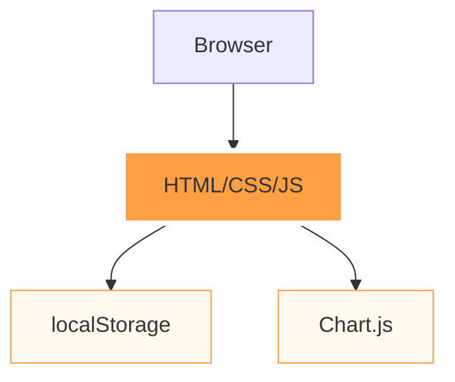
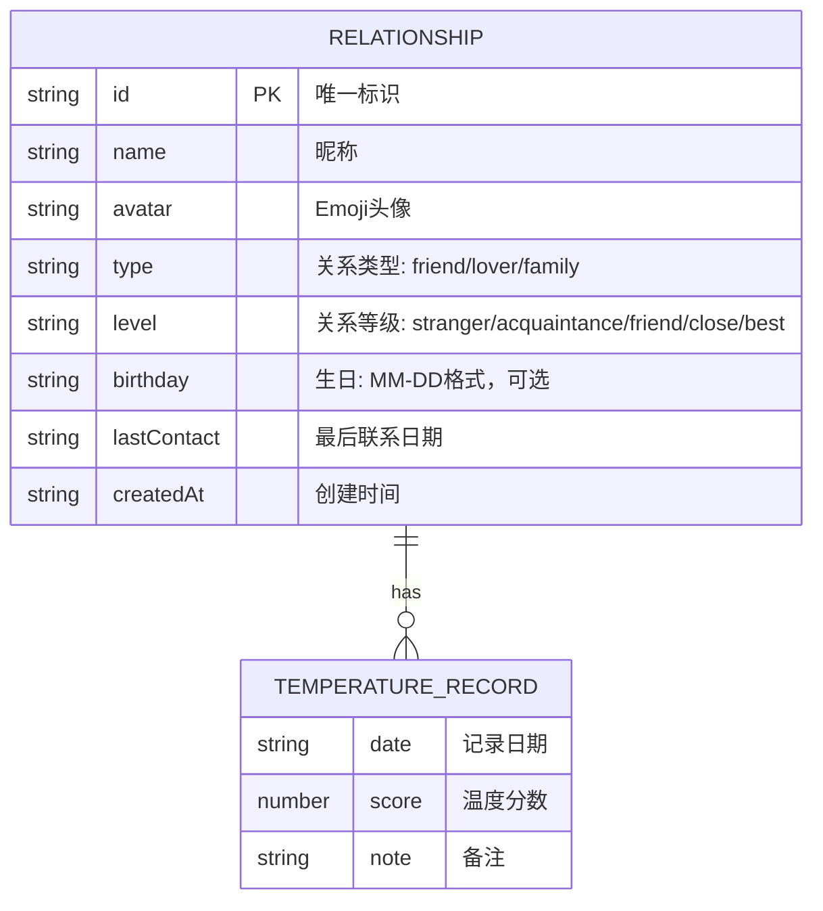

# 暖流 - 技术架构文档

**版本**：v1.0
**日期**：2026-04-13

---

## 1. Architecture Design



纯前端SPA架构，使用localStorage进行数据持久化，Chart.js实现温度曲线可视化。

---

## 2. Technology Description

- **Frontend**: 原生 HTML5 + CSS3 + JavaScript (ES2020)
- **Storage**: localStorage
- **Charts**: Chart.js
- **Styling**: 原生CSS，使用CSS变量
- **Build Tool**: 无需构建工具，直接部署HTML文件

---

## 3. Route Definitions

由于是单页面应用，使用哈希路由：

| Route | Purpose |
|-------|---------|
| #/ | 首页 - 关系卡片展示 |
| #/add | 添加关系页面 |
| #/detail/:id | 关系详情页面 |

---

## 4. Data Model

### 4.1 Data Model Definition



### 4.2 Data Structure

```javascript
// localStorage 数据结构
{
  "relationships": [
    {
      "id": "1",
      "name": "小明",
      "avatar": "🤝",
      "type": "friend",
      "level": "close",
      "birthday": "05-20",
      "lastContact": "2026-04-10",
      "temperatureHistory": [
        { "date": "2026-04-01", "score": 60, "note": "刚吵完架" },
        { "date": "2026-04-10", "score": 65, "note": "和好了" }
      ],
      "createdAt": "2026-04-01"
    }
  ]
}
```

### 4.3 常量定义

```javascript
// 关系类型
const RELATIONSHIP_TYPES = {
  friend: { label: '朋友', icon: '👥' },
  lover: { label: '恋人', icon: '❤️' },
  family: { label: '家人', icon: '🏠' }
};

// 关系等级
const RELATIONSHIP_LEVELS = {
  stranger: { label: '陌生', value: 0 },
  acquaintance: { label: '认识', value: 1 },
  friend: { label: '熟识', value: 2 },
  close: { label: '亲密', value: 3 },
  best: { label: '挚友', value: 4 }
};

// 头像选项
const AVATAR_OPTIONS = ['😊', '🤝', '❤️', '🎉', '🎁', '🌟', '🌸', '☀️', '🌙', '🔥', '💫', '🌈', '🎨', '🎵', '🏠', '👨‍👩‍👧', '👥', '🤗', '💪', '🎯'];
```
